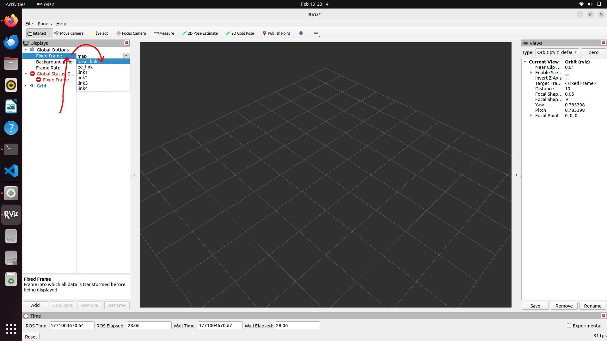
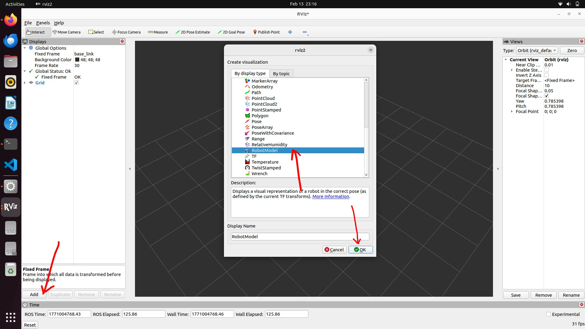
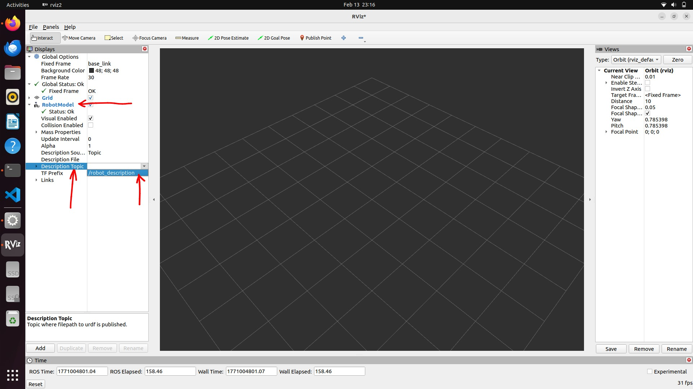
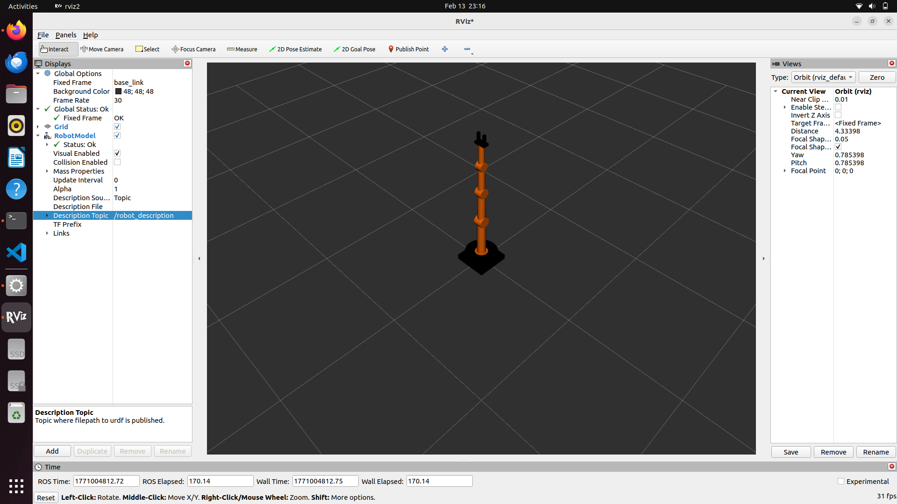

# Robot Controller - Hand-controlled 4-DOF Arm

This ROS 2 package provides a hand-gesture controlled interface for a 4-degree-of-freedom (4-DOF) robot arm. It uses a webcam to detect hand gestures (finger counting) via MediaPipe and maps them to robot joint movements.

## Features

-   **Hand Gesture Control**: Uses a webcam to detect finger counts (1-5).
    -   1-4 fingers: Selects and toggles movement for Joint 1-4 respectively.
    -   5 fingers (open hand): Resets/Moves all joints to their minimum position.
    -   0 fingers (fist): Stops movement.
-   **Visual URDF Model**: A visually improved URDF model of the robot arm with distinct link colors and joint hubs.
-   **Rviz Integration**: Visualize the arm's state in real-time.

## Prerequisites

-   **ROS 2** (Humble, Iron, or Rolling recommended)
-   **Python 3.8+**
-   **Webcam**

### Python Dependencies

Install the required Python libraries:

```bash
pip3 install opencv-python mediapipe numpy
```

## Installation

1.  **Create a ROS 2 Workspace** (if you don't have one):
    ```bash
    mkdir -p ~/ros2_ws/src
    cd ~/ros2_ws/src
    ```

2.  **Clone or Copy the Package**:
    Copy this `robot_controller` folder into your workspace `src` directory.

3.  **Build the Package**:
    ```bash
    cd ~/ros2_ws
    colcon build --packages-select robot_controller
    ```

4.  **Source the Workspace**:
    ```bash
    source install/setup.bash
    ```

## Usage

To launch the entire system (hand detector, arm controller, robot state publisher, and Rviz):

```bash
ros2 launch robot_controller bringup.launch.py
```

## Rviz Configuration
Open a new terminal and run:

```bash
rviz2
```
After Rviz is launched, you will see a screen like below. Click on "Fixed Frame", by default, "map" will be selected, you have to exapnad the drop-down menu and select "base_link" from the options.



After that click on "Add", scroll down a little bit, select "RobotModel" and then click "Ok".



Upon completing the previous two steps, "RobotModel" will be added to the "Displays". Click on "RobotModel", expand the drop-down menu, you will see several options. cilck on "Description Topic", expand the drop-down menu again and select "/robot_description". 



Congratulation! You are ready to control the robotic arm with you finger.



### Controls

Once the application is running, a "Hand Detector" window will appear showing the webcam feed. Show your hand to the camera:

-   **1 Finger**: Move Joint 1 (Base).
-   **2 Fingers**: Move Joint 2 (Shoulder).
-   **3 Fingers**: Move Joint 3 (Elbow).
-   **4 Fingers**: Move Joint 4 (Wrist).
-   **5 Fingers (Open Hand)**: Reset all joints to start position.
-   **Fist (0 Fingers)**: Stop all movement.

## Troubleshooting

-   **Camera not found**: Ensure your webcam is connected and accessible. You may need to change the device index in `hand_detector.py` (line 15) if you have multiple cameras.
-   **MediaPipe errors**: Ensure you have installed `mediapipe` correctly via pip.
